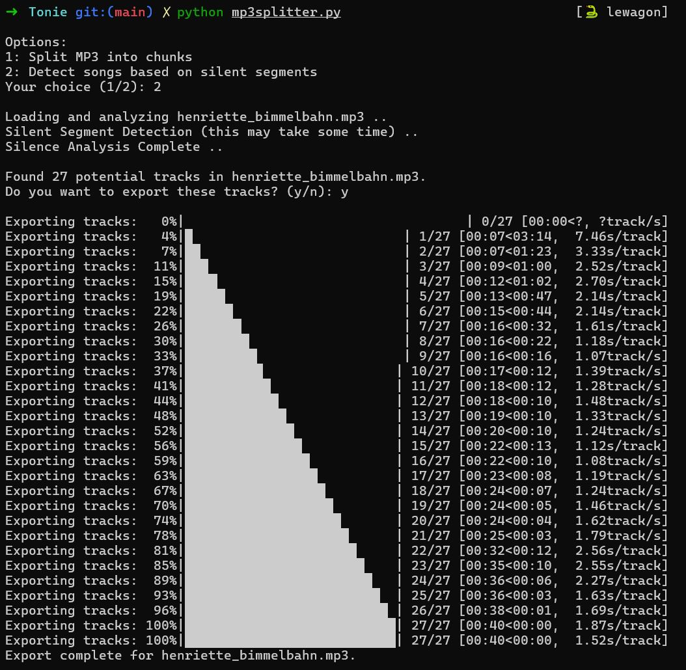

# MP3 Splitter (& Track Identification)

A simple Python script offering two functionalities:

1. **Split MP3 Files into Chunks:**  
   Splits MP3 files from an `input` folder into smaller chunks of a user-defined size (in MB). The chunks are saved in organized subfolders within an `output` folder.

2. **Detect Songs Based on Silence:**  
   Analyzes MP3 files to detect potential tracks using silence detection. The script reports the number of detected tracks and optionally exports them to organized subfolders in the `output` folder. A progress indicator is shown during export.

## Requirements

- Python 3.6 or higher
- FFmpeg (required for pydub)
- Required Python packages:
  - `pydub`
  - `tqdm`

## Setup

1. **Create Folders**

   - **Input Folder:** Create an `input` folder and place your `.mp3` files there.
   - **Output Folder:** Create an `output` folder where the processed files will be saved.

2. **Install Dependencies**

   Install the Python packages using pip:
   ```bash
   pip install pydub tqdm

3. **Usage**

`python mp3splitter.py`



